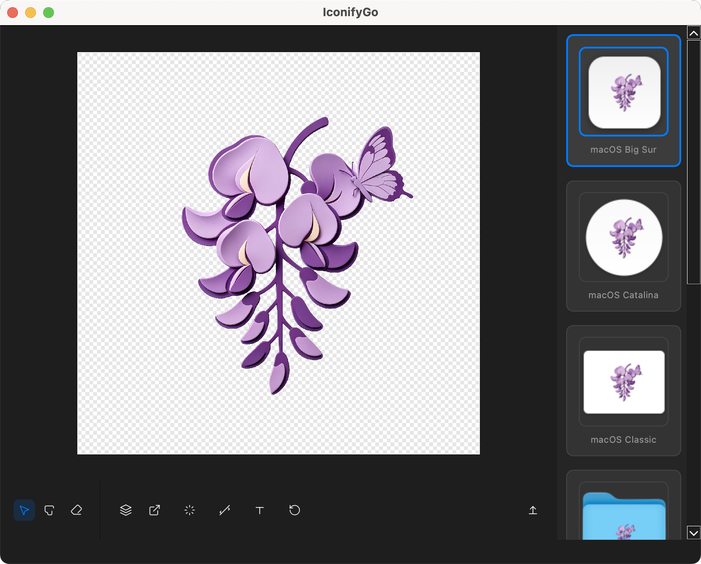

# IconifyGo

IconifyGo 是一款专为开发者和设计师打造的 macOS 风格图标与文件夹处理工具。它可以一键去除背景、清除水印，并快速生成符合 macOS 系统规范的应用图标和自定义样式的文件夹。



## 核心功能

*   **智能去背景 (Auto Remove BG):** 集成 `rembg` 本地 AI 模型（支持 u2net / isnet-general-use / birefnet-general），一键自动抠图，保护隐私且无需网络。
*   **水印去除 (Watermark Removal):** 基于 OpenCV 多轮修复算法，手动标记水印区域后自动擦除，支持轻度/中度/深度三种强度。
*   **手动掩码微调 (Manual Mask Editing):** 提供画笔 (Brush) 和橡皮擦 (Eraser) 工具，支持圆形/方形/椭圆笔刷，可对抠图结果进行像素级微调。
*   **App 图标风格化:** 自动为 Logo 添加 macOS Big Sur (圆角矩形)、Catalina (圆形) 或 Classic (矩形) 风格的底座、渐变和阴影。
*   **文件夹定制 (Folder Customization):** 
    *   内置 macOS 文件夹模板，支持调节颜色与透明度。
    *   支持 Center 和 Cover 两种布局将 Logo 叠加到文件夹上。
*   **文档图标定制 (Document Style):** 将 Logo 叠加到 macOS 文档图标上，支持 Center 和 Cover 两种布局。
*   **文字/表情叠加 (Text & Emoji Overlay):** 支持在图标上添加文字或 Emoji，可自定义字体、粗细、颜色、对齐方式和大小。
*   **实时预览:** 右侧预览面板实时展示所有 7 种风格（3 种图标 + 2 种文件夹 + 2 种文档）的渲染结果，点击即可切换导出风格。
*   **画布操作:** 支持滚轮缩放、拖拽平移、双击自适应、拖放导入图片。
*   **多格式导出:** 一键导出 `.icns` (macOS 格式) 或全尺寸 PNG 图标集 (16x16 至 1024x1024)。

## 技术架构

*   **界面框架:** [PySide6](https://doc.qt.io/qtforpython-6/) (Qt for Python)
*   **图像处理:** [OpenCV](https://opencv.org/) & [Pillow](https://python-pillow.org/)
*   **AI 抠图:** [rembg](https://github.com/danielgatis/rembg)
*   **交互逻辑:** 基于 `QGraphicsView` 的高性能画布系统。

## 快速开始

### 1. 环境准备

确保你的电脑已安装 Python 3.8+。

### 2. 安装依赖

建议在虚拟环境中运行：

```bash
# 创建并激活虚拟环境
python3 -m venv .venv
source .venv/bin/activate

# 安装必要库
pip install -r requirements.txt
```

### 3. 下载 AI 模型

项目使用 `rembg` 进行本地 AI 抠图，需要将 ONNX 模型文件放置到 `~/.config/IconifyGo/` 目录下（模型文件较大，不随仓库分发）：

```bash
mkdir -p ~/.config/IconifyGo
```

需要下载以下 3 个模型文件并放入该目录：

| 模型 | 用途 | 下载地址 |
|------|------|---------|
| `u2net.onnx` | 通用背景去除 | [GitHub Releases](https://github.com/danielgatis/rembg/releases) |
| `isnet-general-use.onnx` | 高精度背景去除 | [GitHub Releases](https://github.com/danielgatis/rembg/releases) |
| `birefnet-general.onnx` | 双边细化网络 | [GitHub Releases](https://github.com/danielgatis/rembg/releases) |

> 模型文件可从 [rembg Releases](https://github.com/danielgatis/rembg/releases) 页面下载对应 `.onnx` 文件。

### 4. 运行应用

```bash
python3 src/main.py
```

## 开发计划

- [x] 自动背景去除
- [x] 手动掩码编辑工具 (Brush, Eraser)
- [x] 水印去除 (OpenCV 多轮修复)
- [x] App 图标样式模板 (Big Sur, Catalina, Classic)
- [x] 文件夹定制引擎
- [x] 文档图标定制引擎
- [x] 文字/Emoji 叠加
- [x] 实时异步预览
- [x] ICNS 与 PNG 集导出
- [ ] 批量处理文件夹内所有图片
- [ ] 接入更多云端抠图 API 作为补充

## 许可证

MIT License
